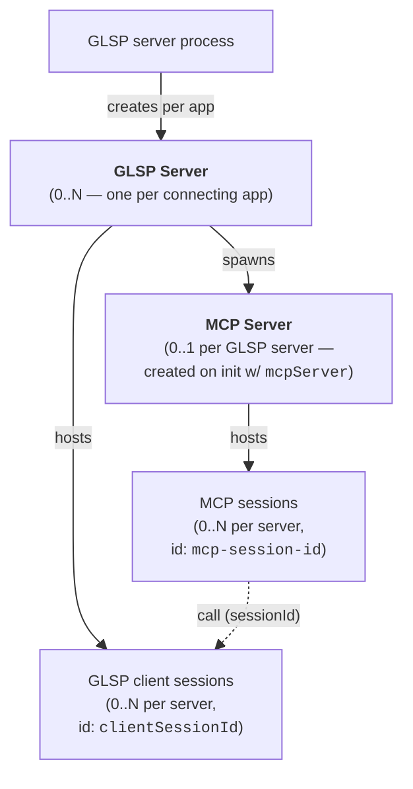
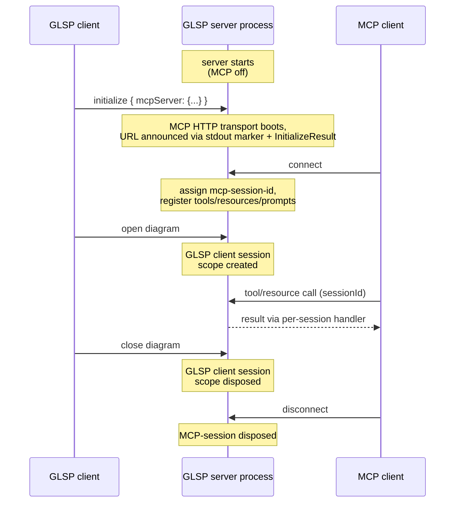

# @eclipse-glsp/server-mcp — Architecture & Extension Guide

> **Status: Experimental.** The MCP integration is under active development. Option names, schema shapes, and handler contracts MAY change in minor releases until the feature graduates from experimental status. See the [README](./README.md) for the integration quickstart.

## Table of Contents

-   [Architecture](#architecture)
    -   [Container Scopes](#container-scopes)
    -   [Session Lifecycle](#session-lifecycle)
    -   [Supported MCP Features](#supported-mcp-features)
-   [Security & Threat Model](#security--threat-model)
-   [Diagram-Specific Overrides](#diagram-specific-overrides)
-   [Server Configuration](#server-configuration)
-   [Deployment Model](#deployment-model)
-   [Resource vs. Tool Mode](#resource-vs-tool-mode)
-   [ID Aliasing](#id-aliasing)
-   [Extending with Custom Handlers](#extending-with-custom-handlers)

---

## Architecture

A GLSP server process creates a GLSP server per connecting application, and each GLSP server runs its own MCP HTTP server. In typical desktop-IDE deployments only one app connects per process, so "one process, one MCP server" holds in practice; architecturally the GLSP server is still the unit.

Two session terminologies coexist and are kept distinct in code:

-   **GLSP client session** — one open diagram, identified by `clientSessionId`.
-   **MCP session** — one MCP client (e.g., an editor's chat panel) connected to the HTTP endpoint, identified by the MCP protocol's `mcp-session-id` header.

The two have independent lifetimes. The same MCP client can talk to multiple GLSP client sessions through one MCP HTTP connection.



### Container Scopes

Handlers and services are bound across two Inversify container scopes:

| Scope                   | Lifetime                          | Conceptually                                                                                                   | Bound via                                                                                  |
| ----------------------- | --------------------------------- | -------------------------------------------------------------------------------------------------------------- | ------------------------------------------------------------------------------------------ |
| **Server**              | Lives as long as the GLSP process | The MCP HTTP server, transport, and server-scope handlers (singleton across all diagrams).                     | `DefaultMcpServerModule`                                                                   |
| **GLSP client session** | Lives as long as one open diagram | Per-diagram services (id alias, model serializer, element-type provider, …) and per-session handler instances. | `DefaultMcpDiagramModule` (mounted inside the GLSP-server-core `configureDiagramModule()`) |

The split matters: server-scope services are singletons; client-session-scope services give each open diagram its own instance, which is why aliased IDs in one session can't bleed into another and why per-session handlers see "their" model state directly.

### Session Lifecycle

The GLSP-server, GLSP-client-session, and MCP-session lifetimes are independent. A GLSP client session can outlive the MCP client that triggered work in it; an MCP client can survive the close of any single GLSP client session.



### Supported MCP Features

This package targets the **MCP `2025-06-18` specification** (revision pinned by `@modelcontextprotocol/sdk` `^1.29.0`). The matrix below tracks which spec features are exercised, declared, or deliberately deferred.

| Feature                                                                                              | Status       | Notes                                                                                                                                                                                                                                                     |
| ---------------------------------------------------------------------------------------------------- | ------------ | --------------------------------------------------------------------------------------------------------------------------------------------------------------------------------------------------------------------------------------------------------- |
| **Tools** (`tools/list`, `tools/call`)                                                               | Supported    | Default tool set covers diagram inspection and modification; adopters extend.                                                                                                                                                                             |
| **Tool annotations** (`destructiveHint`, `readOnlyHint`, `idempotentHint`, `openWorldHint`, `title`) | Supported    | Per-handler honest defaults; flat-field surface on the handler base.                                                                                                                                                                                      |
| **Tool `outputSchema` / `structuredContent`**                                                        | Supported    | Dual-emit per-handler `outputSchema` + structured payload, forwarded to `CallToolResult.structuredContent`.                                                                                                                                               |
| **Resources** (`resources/list`, `resources/read`, `resources/templates/list`, `resources/complete`) | Supported    | Templated URIs supported via `{sessionId}` / `{diagramType}` placeholders. URI identity is kept only where it pays off (e.g., embeddable image content); other read endpoints ship as plain tools — see [Resource vs. Tool Mode](#resource-vs-tool-mode). |
| **Prompts** (`prompts/list`, `prompts/get`)                                                          | Supported    | Infrastructure plus a couple of exemplar prompts; adopters extend.                                                                                                                                                                                        |
| **Logging** (`logging/setLevel`, `notifications/message`)                                            | Supported    | Handler-emitted logs route to both the GLSP `Logger` and the connected MCP client. `logging/setLevel` adjusts a per-MCP-session severity threshold (RFC 5424); messages below threshold are dropped on the MCP side, GLSP-side logging keeps everything.  |
| **Progress** (`notifications/progress`)                                                              | Supported    | Best-effort beat from server-side handlers. Client must opt in via `_meta.progressToken`; no-op otherwise.                                                                                                                                                |
| **Capability sub-flags** (`listChanged`)                                                             | Supported    | `resources.listChanged` flips on as soon as diagram-scope resources are bound (catalog mutates with GLSP client session add/remove); `tools` / `prompts` catalogs are fixed at MCP-session-init.                                                          |
| **Streamable HTTP transport** with SSE                                                               | Supported    | `Last-Event-ID` resumability via a bounded LRU event store.                                                                                                                                                                                               |
| **`MCP-Protocol-Version` header validation**                                                         | Supported    | Middleware validates per-spec on non-initialize requests: absent → pass-through (the server defaults to `2025-03-26`, itself spec-mandated for backwards-compatibility); unsupported → HTTP 400 with JSON-RPC envelope.                                   |
| **Origin / Host validation**                                                                         | Supported    | DNS-rebinding mitigation per spec.                                                                                                                                                                                                                        |
| **Cancellation** (`notifications/cancelled`)                                                         | _Deferred_   | Cancel notifications aren't propagated to running handlers; long-running tools complete before any cancel takes effect. Real adopter need (slow exports, long validations); revisit when a use case surfaces.                                             |
| **`tasks` capability**                                                                               | _Deferred_   | Spec experimental in `2025-11-25`; effectively zero client support today. Progress notifications cover the same UX gap with universal client support.                                                                                                     |
| **`resources/subscribe`**                                                                            | _Deferred_   | Real feature work — needs subscription registry, model-state change-event bridge, debounce, URI granularity. Not in scope for this branch.                                                                                                                |
| **Sampling** (`sampling/createMessage`)                                                              | _Not needed_ | This package is the MCP _server_; it doesn't request LLM completions back from the client.                                                                                                                                                                |
| **Roots** (`roots/list`)                                                                             | _Not needed_ | The MCP server has no filesystem-roots concern; diagram source URIs are managed by GLSP core.                                                                                                                                                             |

---

## Security & Threat Model

The shipped defaults assume a **single trusted local process** reaching the MCP server over loopback — the desktop-IDE deployment shape (VS Code Copilot, Theia AI, Claude Desktop). The server is **not** hardened for hostile multi-tenant or public-internet exposure.

The server binds to loopback only by default, with the spec-mandated `Host`-header validation enabled to defeat DNS rebinding. If an adopter widens the bind beyond loopback without explicitly acknowledging the missing authentication layer, the launcher refuses to start — an opt-in flag exists for the case where an external mechanism (reverse proxy, mTLS, network ACL) authenticates traffic before it reaches the endpoint.

There is no CORS handling, no authentication, and no per-session connection cap or rate limiting. Combined with the spec-mandated long-lived SSE streams, a misbehaving local client can hold sockets open. This is acceptable for desktop dev tooling; not acceptable beyond loopback.

SSE event resumability uses an in-memory per-session LRU event store with a configurable cap; sessions and their stores are released on transport close.

If the deployment shape changes — exposing the server to a network, or allowing untrusted local processes — the adopter must add an authenticating reverse proxy (or equivalent) in front. This package does not provide one.

---

## Diagram-Specific Overrides

The MCP integration ships drop-in defaults that work on any GLSP model, but three of them produce deliberately generic output and emit a one-time warning when used. Non-workflow adopters get measurably better LLM-driven results by binding diagram-specific subclasses on their `DiagramModule`:

| Service                | Default behavior                                                                                                                                        | Why override                                                                                                                      |
| ---------------------- | ------------------------------------------------------------------------------------------------------------------------------------------------------- | --------------------------------------------------------------------------------------------------------------------------------- |
| `McpModelSerializer`   | Flattens every attribute and renders one Markdown table per element type. Correct on any GLSP model; loses semantic structure (compartments, ordering). | Preserve type-aware ordering, drop attributes that mean nothing to the LLM, surface domain-relevant grouping.                     |
| `ElementTypesProvider` | Scrapes `OperationHandlerRegistry` for `createNode_`/`createEdge_` keys. Returns an empty list when adopters use other registration conventions.        | Avoid the silent-empty trap when adopter keys don't follow the prefix convention; supply rich `description` / `acceptsText`.      |
| `McpLabelProvider`     | Returns the first direct `GLabel` child. Misses labels nested inside header/compartment containers.                                                     | Reach labels nested inside header/compartment containers — one `getLabel(element)` override fixes every label-aware tool at once. |

The workflow example (`examples/workflow-server`) ships a workflow-specific serializer and label provider as a reference implementation.

---

## Server Configuration

The MCP server is configured through the GLSP `InitializeParameters`. **The presence of an `mcpServer` key — even as an empty object `{}` — is the opt-in signal**: with it, the MCP server starts; without it, MCP is disabled. The value's content controls how the server is configured.

```typescript
// MCP enabled, all defaults
{ ..., mcpServer: {} }

// MCP enabled, custom port
{ ..., mcpServer: { port: 12345 } }

// MCP disabled (do not include the key)
{ ... }
```

The configuration surface is split along an **init/deploy axis**:

-   **Init-controllable** (table below) — the IDE/MCP-aware GLSP client sets these per `initialize` call. Behavioral and tuning fields whose blast radius is bounded.
-   **Deploy-only** — the adopter sets these on the server-module defaults at deploy time. Security-sensitive bind/policy fields are intentionally _not_ reachable from the wire-protocol init payload (e.g., to avoid LLM-driven init payloads widening the network attack surface or weakening the DNS-rebinding mitigation). `port` lives on the init side because pinning a specific port is a legitimate IDE concern with a local blast radius; `host` lives on the deploy side because letting an init payload widen the bind from loopback would re-open the DNS-rebinding attack pattern.

### Init-controllable options

| Option                    | Type                     | Default      | Description                                                                                                                                                                                           |
| ------------------------- | ------------------------ | ------------ | ----------------------------------------------------------------------------------------------------------------------------------------------------------------------------------------------------- |
| `port`                    | `number`                 | `0` (random) | Port the MCP HTTP server listens on. The resolved port is reported back via the `InitializeResult` and the stdout marker. See [Deployment Model](#deployment-model) for guidance on random vs. fixed. |
| `route`                   | `string`                 | `'/mcp'`     | HTTP route path for the MCP endpoint.                                                                                                                                                                 |
| `name`                    | `string`                 | `'glsp'`     | Name reported in the MCP server handshake. Adopters typically override (e.g. `'glsp-workflow'`) so multiple GLSP-based MCP servers group together in the IDE's MCP server list.                       |
| `options.dataMode`        | `'resources' \| 'tools'` | `'tools'`    | How data handlers are exposed to the MCP client. See [Resource vs. Tool Mode](#resource-vs-tool-mode).                                                                                                |
| `options.agentPersona`    | `string`                 | _built-in_   | The agent-persona instructions sent to connecting MCP clients via the MCP server's `instructions` field.                                                                                              |
| `options.eventStoreLimit` | `number`                 | `10000`      | Maximum SSE events retained per session in the in-memory event store (LRU-evicted). Must exceed the worst-case in-flight event count for `Last-Event-ID`-based resume to work.                        |

### Deploy-only options

Adopters set these on the server module's defaults binding (see [Integrating into a GLSP Server](./README.md#integrating-into-a-glsp-server)). They are sourced _only_ from the adopter defaults — same-named fields supplied via the init payload are ignored.

| Option           | Type       | Default                      | Description                                                                                                                                                                                                            |
| ---------------- | ---------- | ---------------------------- | ---------------------------------------------------------------------------------------------------------------------------------------------------------------------------------------------------------------------- |
| `host`           | `string`   | `'127.0.0.1'`                | Host/interface the MCP HTTP server binds to. Pinned to loopback by default; widening it is an explicit deploy-time decision.                                                                                           |
| `allowedHosts`   | `string[]` | `['127.0.0.1', 'localhost']` | Allowlist for the HTTP `Host` header — requests whose `Host` is not on this list get `403 Forbidden`. Spec MUST per the Streamable HTTP transport's DNS-rebinding mitigation; widen only if `host` itself was widened. |
| `allowedOrigins` | `string[]` | —                            | Allowlist for the HTTP `Origin` header. Leave unset for desktop-IDE MCP clients (which omit `Origin`); set explicitly when fronted by a browser-based MCP client.                                                      |

### Discovering the resolved URL

Once started, the resolved URL is reported back in the `InitializeResult` under `result.mcpServer`:

```typescript
interface McpServerResult {
    name: string;
    type: 'http'; // transport-type discriminator
    url: string; // e.g. "http://127.0.0.1:54321/mcp"
    headers?: Record<string, string>; // extension point: a transport subclass that
    // adds auth (or an adopter fronting the endpoint with a proxy) populates this
    // so AI clients include the required headers when connecting. Empty by default.
}
```

The shape aligns with the configuration formats used by IDE-side MCP integrations (e.g., VS Code's `.vscode/mcp.json`, Theia's `RemoteMCPServerDescription`) so the result can be mapped directly into a client-side MCP-client configuration.

In addition, the server logs a tagged line to stdout when ready, mirroring the GLSP server's own startup announcement:

```
[GLSP-MCP-Server]:Ready. {"name":"glsp","url":"http://127.0.0.1:54321/mcp","route":"/mcp"}
```

The tag is exported as `MCP_SERVER_READY_MSG` so IDE integrations can parse the line and surface the URL automatically.

### Transport

The MCP server uses the **Streamable HTTP transport** (`WebStandardStreamableHTTPServerTransport` from the MCP SDK). HTTP `POST` carries client → server JSON-RPC; `GET` returns the server → client SSE stream (with `Last-Event-ID` resumability); `DELETE` terminates a session. Sessions are multiplexed on a single endpoint via the `mcp-session-id` header.

A periodic server-initiated `ping` keeps the SSE GET stream alive across chat-idle periods, so client-side read timeouts (e.g. undici's 5-min `bodyTimeout`) don't force a reconnect cycle.

#### Portable handler — Node, browser, and web-runtime targets

The launcher exposes a Fetch-API `handleRequest(req: Request): Promise<Response>` that any runtime with a `fetch`-shaped listener can drive — Node (via `@hono/node-server`), Bun, Deno, Cloudflare Workers, and in-page Web Workers. Two concrete launcher subclasses ship:

-   `McpServerLauncher` (Node) binds a Hono listener and announces the loopback URL.
-   `WebMcpServerLauncher` (browser / web-runtime) returns no transport endpoint; the adopter wires `launcher.getRequestHandler()` into their own listener.

For the browser/Web-Worker case where the GLSP client and the MCP server share a tab, `McpWorkerBridge` (in `@eclipse-glsp/server-mcp/browser`) plumbs Service-Worker→Web-Worker `MessageChannel` traffic into the launcher. The matching page-side proxy — a Service Worker that intercepts `fetch('/mcp', …)` and forwards each `Request` over a `MessageChannel` — is host-side scaffolding that adopters own. The browser demo at `examples/workflow-server-mcp-demo/` is the canonical end-to-end reference, including a working `mcp-service-worker.js`.

Auth and shared session state for non-loopback deploys (Cloudflare DurableObjects-style multi-isolate setups) are explicitly out of scope — adopters wrap `getRequestHandler()` with their own middleware.

---

## Deployment Model

The MCP server runs **inside each GLSP server** (which is per connecting app, not per process). One GLSP server = one MCP server = one TCP port. All diagrams in that GLSP server are surfaced through its MCP server, multiplexed via `clientSessionId`. A process hosting multiple connected apps therefore hosts multiple GLSP servers and multiple MCP servers on distinct ports; typical desktop-IDE deployments connect one app per process, so the 1:1 case is what most adopters see.

### Single-process scenarios (the common case)

-   **Standalone**: `node app.js` → one GLSP process, one MCP server.
-   **VS Code per-window**: each VS Code window spawns its own GLSP process. Within a window, all diagrams share that process. No port conflict.
-   **Theia per-frontend**: each Theia frontend has its own GLSP process; same shape.

### Multi-process: not auto-supported

If two GLSP processes start on the same machine at the same time and both request the same fixed port, the second one's MCP server fails to bind with `EADDRINUSE`. The error message names the offending host:port and points at the override path. To run multiple GLSP processes concurrently on one machine, the adopter must pass distinct ports per process. We deliberately do **not** ship a cross-process aggregator, a discovery daemon, or a filesystem-based instance directory — the multi-application case is left to adopter configuration.

A few alternatives were considered and rejected:

-   **Discovery files + standalone aggregator daemon.** Adds a long-lived companion process and a new shipping artifact with its own versioning, lifecycle, and security model — substantial cost for a use case (multi-window-on-one-machine) that's rare in practice.
-   **Shared launcher process across applications.** Would require IDE integrations (e.g. the GLSP VS Code integration) to detect-or-spawn rather than always-spawn their GLSP child process. The detect-or-spawn pattern doesn't exist in the upstream integrations today, so this is conditional on prior work landing there.
-   **In-process multi-application MCP.** Re-binding the MCP launcher above the per-`GLSPServer` containers so one process could host multiple applications behind one MCP server. Doesn't apply under the current per-window-process deployment, which yields one `GLSPServer` per process — there's nothing to multiplex inside the process. Only meaningful as a follow-up to shared-launcher mode.

### Choosing a port: random vs. fixed

Both the GLSP server itself and this MCP server default to **random port allocation** (`port: 0`). The chosen port is announced via the resolved `InitializeResult.mcpServer.url` and the stdout `[GLSP-MCP-Server]:Ready.` marker.

-   **Random (default)** is correct when the IDE integration consumes the resolved URL programmatically (e.g., reads the stdout marker and registers the URL with its native MCP infrastructure). It avoids `EADDRINUSE` entirely.
-   **Fixed** is correct when an external MCP client (Claude Desktop, web client, etc.) is configured statically with the URL. The adopter pins `port` per init call so the URL is stable across restarts.

### Connecting MCP clients

Two paths, depending on the client class:

-   **IDE-internal MCP clients** (VS Code Copilot chat, Theia AI, etc.) consume the resolved URL programmatically — the GLSP IDE integration reads it from `InitializeResult.mcpServer` (or, on the spawn side, the `MCP_SERVER_READY_MSG` stdout marker) and registers it with the host IDE's native MCP infrastructure:
    -   **Theia**: `@eclipse-glsp/theia-mcp-integration` ships a `FrontendApplicationContribution` that auto-registers every GLSP server's MCP URL with `@theia/ai-mcp` on startup. No adopter wiring beyond installing the package.
    -   **VS Code**: `@eclipse-glsp/vscode-integration` exposes a `GlspMcpServerProvider` (a `vscode.McpServerDefinitionProvider` implementation). Adopters declare an `mcpServerDefinitionProviders` contribution in their extension's `package.json`, register the provider via `vscode.lm.registerMcpServerDefinitionProvider`, and feed it the GLSP `InitializeResult` via `addServer(...)`. See `example/workflow/extension/src/workflow-extension.ts` in the integration repo for the canonical wiring.
-   **External MCP clients** (Claude Desktop, web clients, etc.) are configured separately by the user with a stable URL. For these, pick a fixed port and document it in the adopter's setup guide.

---

## Resource vs. Tool Mode

`options.dataMode` controls how data handlers are surfaced. Two values:

-   `'tools'` (default) — handlers register as MCP tools. Most in-the-wild MCP clients support tools more reliably than resources, so this is the safer default.
-   `'resources'` — handlers register as URI-addressable resources (the spec-aligned form). Use this when the client is known to handle resources well.

Handlers that don't represent URI-addressable data (text-only reads, all write tools) are always plain tools regardless of `dataMode`.

Adopters who want their own URI-addressable read endpoints extend the resource handler base and set `toolAlternativeInputSchema` on the handler to also opt into the tool fallback — a GLSP-specific affordance for clients that don't speak resources, not an MCP spec feature. The shipped diagram-render handlers (PNG / SVG) are the canonical examples of this pattern.

---

## ID Aliasing

Verbose real IDs (UUIDs, structural paths) consume LLM tokens and clutter prompts. The MCP integration replaces them on the wire with short, sequential aliases. The aliasing is **per GLSP client session**, so aliases issued in one session don't bleed into another.

Resolution is not transparent: handlers convert IDs at the boundary — alias outgoing IDs, look up incoming ones. The mint loop records every real id that flows through `alias()` and skips counter values that would collide, so the convention is self-protecting as long as it's followed. Custom handlers that emit raw real IDs without going through the alias service can re-open a corner case where the alias counter mints, say, `42` for some real id, and a later real model element with id `42` becomes ambiguous on lookup. Keep alias-at-boundary in adopter code.

A pass-through implementation (no aliasing, useful for diagnostics) ships alongside the default; adopters can swap in their own strategy via the `bindIdAliasService()` hook on the diagram module.

---

## Extending with Custom Handlers

Handler bases come in three flavors, picked by where the handler lives:

| Base class                          | Scope                   | When to use                                                                                            |
| ----------------------------------- | ----------------------- | ------------------------------------------------------------------------------------------------------ |
| `AbstractMcpToolHandler<T>`         | Server-scope            | Tools that don't target a specific diagram session — listing all sessions, querying server-wide state. |
| `AbstractMcpDiagramToolHandler<T>`  | Per GLSP client session | Read-style tools that operate on one diagram. Don't dispatch operations.                               |
| `OperationMcpDiagramToolHandler<T>` | Per GLSP client session | Write-style tools that dispatch a model-mutating GLSP `Operation`. Includes the read-only-mode gate.   |

Resource and prompt handlers follow the same server/diagram split: `AbstractMcpResourceHandler<T>` / `AbstractMcpDiagramResourceHandler<T>`, and `AbstractMcpPromptHandler<T>` / `AbstractMcpDiagramPromptHandler<T>`.

Adopters declare handler metadata as **fields** (`name`, `description`, `inputSchema`, optionally `outputSchema`/`title`) and implement `createResult(params)` — the framework reads those fields, adopters never override `registerTool` / `registerResource` themselves. The generic `T` describes the parsed input shape; specialize it with `z.infer<typeof MyInputSchema>` for type-safe destructuring. Common per-handler injections include `McpLogger` (routes to both the GLSP `Logger` and the connected MCP client) and `McpProgressReporter` (best-effort beat for long-running tools, no-op when the client doesn't opt in via `_meta.progressToken`). Cross-references in prompt text and tool descriptions reference `OtherHandler.NAME` (the static const on each handler) instead of literal strings, so a future rename is a compile-time error rather than silent rot.

A minimal example showing the field-driven shape and the binding hook:

```typescript
@injectable()
export class SessionCountMcpToolHandler extends AbstractMcpToolHandler<SessionCountInput> {
    static readonly NAME = 'session-count';
    readonly name = SessionCountMcpToolHandler.NAME;
    readonly description = 'Count active GLSP sessions, optionally filtered by diagram type.';
    readonly inputSchema = SessionCountInputSchema;
    override readonly outputSchema = SessionCountOutputSchema;

    @inject(ClientSessionManager) protected clientSessionManager: ClientSessionManager;
    @inject(McpLogger) protected logger: McpLogger;

    protected createResult({ diagramType }: SessionCountInput): McpToolResult {
        const sessions = this.clientSessionManager.getSessions();
        const filtered = diagramType ? sessions.filter(s => s.diagramType === diagramType) : sessions;
        this.logger.debug(`session-count → ${filtered.length}`);
        return this.success(`${filtered.length} session(s)`, { count: filtered.length, diagramType });
    }
}

class MyMcpServerModule extends DefaultMcpServerModule {
    protected override configureToolHandlers(binding: McpHandlerMultiBinding<McpToolHandler>): void {
        super.configureToolHandlers(binding);
        binding.add(SessionCountMcpToolHandler);
    }
}
```

The same pattern carries over to the other handler kinds:

-   **Operation tools** dispatch a GLSP `Operation` from `createResult` and inherit a read-only-mode gate. Set `override readonly destructiveHint = true;` for irreversible operations so MCP clients can warn before invocation. A `requestAction(action, timeoutMs)` helper wraps `RequestAction` round-trips with consistent timeout/error handling.
-   **Resources** declare `mimeType` + `uri` (string or templated `{ template: 'glsp://…' }`); the per-session base ships sensible defaults for `list()` and `complete()` covering the common single-resource-per-session case. Setting `toolAlternativeInputSchema` opts the resource into the tool fallback used in `dataMode: 'tools'`.
-   **Prompts** declare `argsSchema` and return `messages` from `createResult`.

For **single-instance services** (model serializer, alias service, …), override the matching `bind*` hook on your module subclass and return the replacement class. For **multi-binding handlers**, use `binding.rebind(StandardHandler, MyHandler)` inside the relevant `configure*Handlers` hook.

The workflow example (`examples/workflow-server`) is the canonical reference — see `workflow-mcp-module.ts` for the binding shape and the workflow-specific serializer / label provider for override examples.

> **Note on operations.** server-mcp does **not** ship a generic `apply-operation` tool or a contribution registry that auto-generates tools from operation kinds. Adopters subclass the operation tool base directly. Both alternatives — a freeform tool and an explicit registry — were considered and rejected: freeform is unsafe (the LLM can smuggle arbitrary kinds, no per-op schema, no guardrails), and a registry doesn't earn its abstraction (real operations almost always need alias-id resolution, custom error mapping, or result enrichment, so adopters graduate to handcrafted handlers anyway).

> **Per-element-type creation hints (roadmap).** Today the create-`*` and modify-`*` tools accept a free-form `args` payload, and per-type guidance flows through `ElementTypeEntry.description`. A declarative `argsShape` so adopters can wire LLM-discoverable per-type creation hints is on the roadmap if a real adopter need surfaces — file an issue if your diagram type would benefit.
